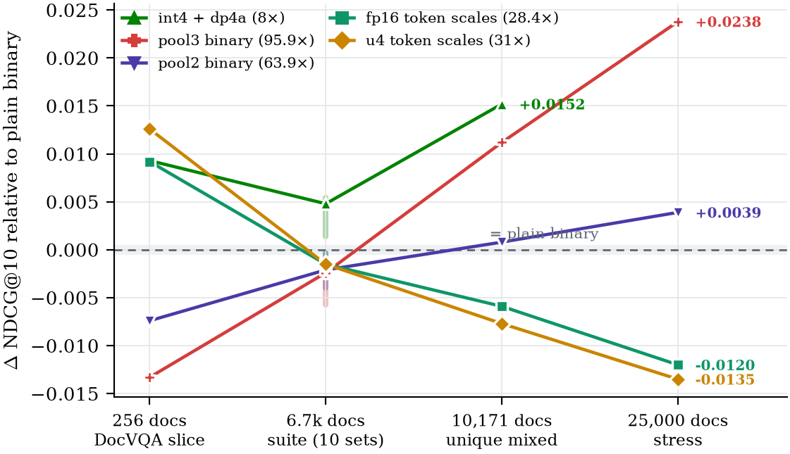

# bitmax

[](https://github.com/Aryagm/bitmax/actions/workflows/ci.yml)
[](LICENSE)

**Exact compressed MaxSim scoring for late-interaction retrieval, with CUDA kernels.**

`bitmax` stores ColBERT/ColPali-style multi-vector document embeddings at
**8×–96× less storage than fp32** and scores them with exact (not approximate)
MaxSim kernels — within 0.002–0.010 NDCG@10 of full dense scoring on the
complete ViDoRe benchmark, at 5–13× the speed of a vectorized dense fp16
baseline on the same GPU.

This is not a vector database, RAG framework, or embedding model. It is the
compressed scoring and reranking layer those systems can call: bring
`[tokens × dim]` embeddings and document offsets, get ranked results.

## Headline results

Mixed unique corpus, **10,171 documents / 256 queries**, ColQwen2 embeddings,
one RTX 4090, repeat 3
(`docs/benchmark_results/raw/paper-unique-10k-final.json`):

| tier | NDCG@10 | recall@10 | latency (256 q) | compression vs fp32 |
| --- | ---: | ---: | ---: | ---: |
| dense fp16 (vectorized) | 0.5068 | 0.6016 | 6.04 s | 2× |
| **int4 + dp4a** (`max_quality`) | **0.5008** | 0.6055 | **1.12 s** | 8× |
| binary (`max_speed`) | 0.4856 | 0.5898 | 0.68 s | 32× |
| pool2 binary | 0.4864 | 0.5938 | 0.45 s | 63.9× |
| **pool3 binary** (`max_compression`) | **0.4968** | **0.6133** | **0.46 s** | **95.9×** |

<p align="center">
  
</p>

For calibration: FAISS GPU mean-pooling (single-vector) collapses to NDCG@10
0.036 on this corpus, and a PLAID-style baseline (`fast-plaid`) matches dense
quality at 3.4× compression — pool3 ties its recall@10 at 28× less storage.

Full ViDoRe suite (10 datasets, complete test splits, 8,443 queries), paired
per-query analysis with 10k-sample bootstrap CIs and two-sided sign tests
(`docs/benchmark_results/raw/significance-suite.json`):

| tier | paired ΔNDCG@10 vs dense | 95% CI | sign-test p |
| --- | ---: | ---: | ---: |
| int4 + dp4a | −0.0018 | [−0.0030, −0.0006] | 0.005 |
| binary | −0.0052 | [−0.0071, −0.0033] | 2×10⁻⁹ |
| fp16 token scales | −0.0067 | [−0.0088, −0.0047] | 4×10⁻¹¹ |
| u4 token scales | −0.0067 | [−0.0088, −0.0047] | 4×10⁻¹¹ |
| pool2 binary | −0.0073 | [−0.0095, −0.0051] | 3×10⁻¹¹ |
| pool3 binary | −0.0089 | [−0.0112, −0.0066] | 6×10⁻¹³ |

All numbers derive from committed JSON artifacts with stored per-query
metrics; see `paper/` for the full write-up and `docs/gpu_optimization.md`
for the complete measurement history, including negative results.

## Quickstart

```bash
# CPU-only
pip install -e .

# with CUDA kernels (requires the CUDA toolkit; arch auto-detected,
# override with BITMAX_CUDA_ARCH)
BITMAX_BUILD_CUDA=1 pip install -e .
```

```python
import bitmax

# embeddings: [total_doc_tokens, dim] float32; offsets: [num_docs + 1] int64
corpus = bitmax.Corpus.from_embeddings(doc_ids, embeddings, offsets)   # mode="balanced"
corpus.save("docs.bitmax.npz")

reranker = bitmax.Reranker.load("docs.bitmax.npz", device="cuda")
results = reranker.search(query_embeddings, k=10)   # [SearchResult(doc_id, score, rank), ...]

# or rerank an external candidate set (ids from your ANN/BM25/DB stage)
reranked = reranker.rerank(query_embeddings, candidate_ids=["doc-17", "doc-03"], k=3)
```

## Choosing a tier

`Corpus.from_embeddings(..., mode=...)` accepts explicit modes or presets:

| preset | recipe | pick when |
| --- | --- | --- |
| `max_quality` | int4 + dp4a int8-query scoring (`Reranker(..., int4_query="int8")`) | quality SLAs at any corpus size — the strongest all-scale tier |
| `balanced` *(default)* | binary + fp16 per-token scales | small corpora (≲500 docs), where magnitude restoration measurably helps |
| `compact` | binary + 4-bit log per-token scales | as `balanced`, 9% smaller index, statistically identical quality |
| `max_speed` | binary signs | large corpora when storage is tight and latency is king |
| `max_compression` | pooled binary (`pool_factor=2\|3`, needs `pip install -e ".[pooling]"`) | 10k+ docs where size dominates — pool3 *beats* plain binary at scale |

**The tier ranking is corpus-size-dependent** (the paper's central finding):
per-token scales help below ~500 documents and hurt at 10k+; pooling
strengthens with scale. When in doubt at scale, use `max_quality` or
`max_compression`; on small corpora, `balanced`.

<p align="center">
  
</p>

Every format's exact byte budget per stored token:

<p align="center">
  
</p>

## What's inside

- **Formats**: packed 1-bit signs (16 B/token at dim 128), optional per-token
  scales (fp16 / 4-bit log / 8-bit log, applied pre-max), per-dimension
  centroid calibration (`binary_q40`), symmetric int4, and Ward-clustered
  token pooling.
- **CUDA kernels** (`cpp/bitmax/cuda_extension.cu`): GPU-resident packed
  corpora; generic + unrolled dim-128 scoring (routed by a measured
  tokens/doc gate); query-byte LUT top-k for integer queries; a dp4a
  int8-query × int4-doc kernel (4.2× over fp32-query int4, rank-identical);
  fused top-k with deterministic tie-breaking. All parity-tested against CPU
  references (`pytest -m cuda`).
- **Kept but unrouted, with evidence**: streaming top-k, dp4a-for-binary, and
  a one-pass q-tiled kernel — each measured slower than what ships, each
  documented in `docs/gpu_optimization.md` so nobody rebuilds them on a hunch.

## Benchmarks & reproduction

- `benchmarks/run_retrieval.py` — quality/latency ladder over embedding caches
  (per-query NDCG vectors persisted for paired statistics).
- `benchmarks/compare_open_source.py` — same-footing comparison vs dense fp16
  (loop **and** vectorized implementations), FAISS, fast-plaid; bitmax rows go
  through the public SDK.
- `benchmarks/significance.py` — paired bootstrap CIs + sign tests from the
  stored per-query vectors.
- `paper/make_figures.py` / `paper/make_tables.py` — regenerate every figure
  (PDF + README PNG) and every exact-value LaTeX table from the committed
  ledger (`docs/benchmark_results/raw/`); no number in the paper is
  hand-typed.
- `python -m benchmarks.reproduce --suite ...` — canonical cache-building and
  comparison recipes. Embedding caches must be built at `--batch-size 1`
  (the builder is not batch-faithful; see docs). For fast rebuilds, run many
  batch-1 builder processes concurrently on one large-memory GPU.

Two honesty notes baked into the methodology: speedups are cited against the
**vectorized** dense baseline (the naïve per-document loop overstates dense
cost 27×), and fast-plaid latency is not cited because it varied 23.5–820 s
across three runs — two at identical tuned parameters — while its quality
stayed at parity (0.5103–0.5119).

## Paper

`paper/main.tex` — *Compression Tiers for Late-Interaction Visual Document
Retrieval: A Measured Accuracy–Size–Latency Frontier* — typeset on the
arXiv preprint template, with all figures and exact-value tables generated
from the artifact ledger by `paper/make_figures.py` and
`paper/make_tables.py`. Compiles with `tectonic main.tex` from `paper/`.

## Status & limitations

- Latency validated on RTX 4090 (kernel findings may shift on other
  architectures); dim-128 embeddings are the tested path (dim must be
  divisible by 8; several fast paths are dim-128-specific).
- Visual-document (ColPali-family) corpora are the evaluated domain;
  text-only ColBERT corpora are unverified.
- No prebuilt CUDA wheels yet; build from source.

## Citation

If you use bitmax, please cite the paper (see `CITATION.cff`):

> Manjaramkar, A. *Compression Tiers for Late-Interaction Visual Document
> Retrieval: A Measured Accuracy–Size–Latency Frontier.* 2026.

## License

MIT — see [LICENSE](LICENSE).

## Development

```bash
python -m venv .venv
.venv/bin/python -m pip install -e ".[dev]"
pytest -m "not cuda"                                      # CPU suite
BITMAX_BUILD_CUDA=1 pip install -e ".[dev]" && pytest -m cuda   # kernel parity suite
```
