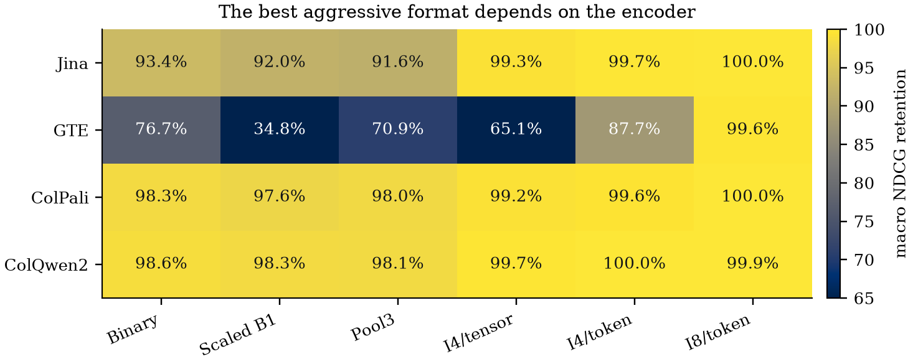
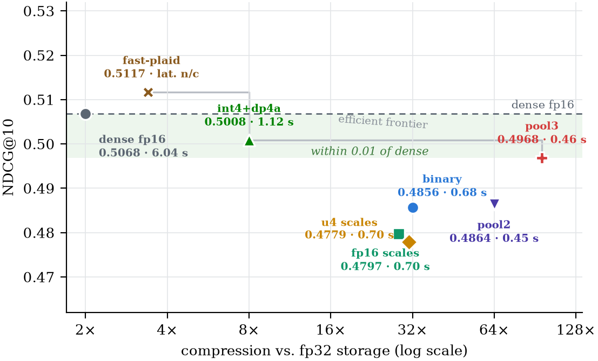
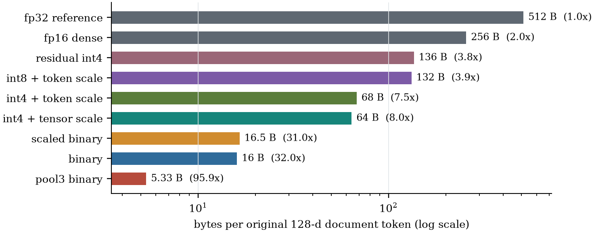

# maxsim

[](https://github.com/Aryagm/maxsim/actions/workflows/ci.yml)
[](LICENSE)

**Compress ColPali/ColBERT-style indexes by 3.8–95.9×, with model-aware format selection.**

`maxsim` is the compression and scoring layer for multi-vector retrieval: it
compresses token/patch embeddings and scores the stored compressed similarities
with exact CUDA reductions for MaxSim, weighted MaxSim, TopK2/TopK4, and
SmoothSim. Full scans add no approximation beyond the chosen compression;
residual cascades with fewer candidates than documents additionally approximate
selection. Across Jina-ColBERT-v2, GTE-ModernColBERT, ColPali-v1.3, and
ColQwen2-v1.0, the conservative per-token int8 control stays within 0.0063
NDCG@10 of dense. More aggressive formats are encoder-dependent: per-token
int4 is nearly lossless for Jina and the visual encoders, while GTE needs
higher fidelity.

```python
import maxsim

# embeddings: [total_doc_tokens, dim] float32; offsets: [num_docs + 1] int64
index = maxsim.Index.from_embeddings(doc_ids, embeddings, offsets)  # mode="auto"
index.save("docs.maxsim.npz")

reranker = maxsim.Reranker.load("docs.maxsim.npz", device="cuda")
results = reranker.search(query_embeddings, k=10)
```

It works with **fixed-dimensional multi-vector embedding models using
dot-product late interaction** (dim divisible by 8; the fastest kernel paths
are tuned for dim 128, the ColBERT/ColPali standard). Validated end-to-end on
Jina-ColBERT-v2 and GTE-ModernColBERT text embeddings plus ColPali-v1.3 and
ColQwen2-v1.0 visual-document embeddings.

This is not a vector database, RAG framework, or embedding model — it is the
compressed scoring and reranking primitive those systems can call.

## Choosing a tier

```text
auto      (default) uses per-token int4 as a convenience starting point
int4      tensor-scale int4 control, 8× smaller, dp4a-accelerated
binary    32× smaller — strongest measured latency tier on visual encoders
pool3     95.9× smaller — validate quality per encoder and dataset
```

`Index.from_embeddings(..., mode=...)` accepts these directly or the full
preset/mode names:

| preset | recipe | pick when |
| --- | --- | --- |
| `auto` *(default)* | per-token int4 (64 B codes + 4 B scale per dim-128 token; 7.53× vs fp32) | you want a convenient first candidate and will validate it |
| `max_quality` | per-token int4 with fp32 queries | an aggressive candidate for Jina and visual encoders; not a universal maximum-quality mode |
| `balanced` | binary + fp16 per-token scales | small corpora (≲500 docs), where magnitude restoration measurably helps |
| `compact` | binary + 4-bit log per-token scales | as `balanced`, 9% smaller index, statistically identical quality |
| `max_speed` | binary signs | large corpora when storage is tight and latency is king |
| `max_compression` | pool3 binary by default (override with `pool_factor=2`; needs `pip install -e ".[pooling]"`) | 10k+ docs where size dominates |

All aggressive modes require calibration on held-out queries from the target
encoder and corpus. Per-token int4 is near lossless for Jina-ColBERT-v2,
ColPali-v1.3, and ColQwen2-v1.0, but loses 0.0651 mean NDCG@10 on
GTE-ModernColBERT. `auto` resolves unconditionally to per-token int4 and is a
convenience alias, not the model-aware selector proposed in the paper. The
near-lossless token-int8 control is currently benchmark-only and has no
dedicated CUDA latency path.
On CUDA dim-128 indexes, `int4_query="int8"` optionally selects the dp4a path
for full-corpus MaxSim search only. Candidate-only reranking, residual
rescoring, and non-MaxSim reducers keep the fp32-query path.

<p align="center">
  
</p>

## Measured results

Mixed unique corpus, **10,171 documents / 256 queries**, ColQwen2 embeddings,
one RTX 4090, repeat 3
(`docs/benchmark_results/raw/paper-unique-10k-final.json`):

| tier | NDCG@10 | recall@10 | latency (256 q) | compression vs fp32 |
| --- | ---: | ---: | ---: | ---: |
| dense fp16 (vectorized) | 0.5068 | 0.6016 | 6.04 s | 2× |
| **tensor-scale int4 + dp4a** | **0.5008** | 0.6055 | **1.12 s** | 8× |
| binary (`max_speed`) | 0.4856 | 0.5898 | 0.68 s | 32× |
| pool2 binary | 0.4864 | 0.5938 | 0.45 s | 63.9× |
| **pool3 binary** (`max_compression`) | **0.4968** | **0.6133** | **0.46 s** | **95.9×** |

<p align="center">
  
</p>

Production-path MaxSim validation on one RTX 4090, 4,096 ragged documents
(64-192 tokens/document), query shape `[4, 32, 128]`, three runs of 20 calls
(`docs/benchmark_results/raw/cuda-step1-rtx4090-20260714.json`):

| operation | P50 | P95 |
| --- | ---: | ---: |
| per-token int4 full scan, fp32 query | 8.34 ms | 8.38 ms |
| per-token int4 top-k, int8 query | 2.72 ms | 2.84 ms |
| fused residual full scan | 16.11 ms | 16.72 ms |
| fused residual, 512 candidates | 2.80 ms | 2.86 ms |
| prefix scan + 512-candidate cascade | 15.87 ms | 16.09 ms |

Per-token scales add 0.2% to tensor-scale full-scan latency. The int8-query
top-k path is 3.08x faster than fp32-query top-k; 512-candidate residual
scoring is 5.75x faster than a residual full scan. All 65 applied release gates
passed.

The companion routing sweep and CUDA validation manifest live beside
the benchmark as `cuda-residual-routing-rtx4090-20260714.json` and
`cuda-validation-rtx4090-20260714.json`; the exact runtime-source snapshot they
identify is `cuda-step1-source-20260714.tgz` (SHA-256 `0e96e50482927623f01abb1f05d71da1e2120cd038a810998c184c113600c59d`).

For calibration: FAISS GPU mean-pooling (single-vector) collapses to NDCG@10
0.036 on this corpus, and a PLAID-style baseline (`fast-plaid`) matches dense
quality at 3.4× compression — pool3 ties its recall@10 at 28× less storage.
One honest caveat: the small pool3-vs-binary quality gap at 10k+ is
query-set-dependent (a 17,763-query re-evaluation of the same corpus
reverses it to −0.006); pooling's robust property is *relative* improvement
with corpus scale plus unconditional storage savings. Pool factors beyond 3
are strictly dominated (measured 2–6).

Full ViDoRe suite (10 datasets, complete test splits, 8,443 queries), paired
per-query analysis with 10k-sample bootstrap CIs and two-sided sign tests
(`docs/benchmark_results/raw/significance-suite.json`):

| tier | paired ΔNDCG@10 vs dense | 95% CI | sign-test p |
| --- | ---: | ---: | ---: |
| int4 + dp4a | −0.0018 | [−0.0030, −0.0006] | 0.005 |
| binary | −0.0052 | [−0.0071, −0.0033] | 2×10⁻⁹ |
| fp16 token scales | −0.0067 | [−0.0088, −0.0047] | 4×10⁻¹¹ |
| u4 token scales | −0.0067 | [−0.0088, −0.0047] | 4×10⁻¹¹ |
| pool2 binary | −0.0073 | [−0.0095, −0.0051] | 3×10⁻¹¹ |
| pool3 binary | −0.0089 | [−0.0112, −0.0066] | 6×10⁻¹³ |

Byte budgets for every released format, including the 68 B/token per-token and
136 B/token residual representations:

<p align="center">
  
</p>

The paper's authoritative result bundle is
`benchmark-results/paper-20260715/`. Retrieval evaluations retain per-query
metrics; end-to-end benchmarks retain raw timing samples, storage reports, and
run signatures. See `paper/` for the full write-up and
`docs/gpu_optimization.md` for the measurement history, including negative
results.

## Install

```bash
# CPU-only
pip install -e .

# with CUDA kernels (requires the CUDA toolkit; arch auto-detected,
# override with MAXSIM_CUDA_ARCH)
MAXSIM_BUILD_CUDA=1 pip install -e .
```

Reranking an external candidate set (ids from your ANN/BM25/vector-DB stage):

```python
reranked = reranker.rerank(query_embeddings, candidate_ids=["doc-17", "doc-03"], k=3)
```

Build the residual format when a small candidate set should receive a second,
higher-fidelity pass. The prefix scans the corpus; the fused prefix+residual
kernel reads only the selected documents and combines both streams before the
reducer. Candidate selection is approximate when `rescore_candidates` is less
than the corpus size; a full-corpus budget bypasses the coarse pass and is exact
for the stored residual representation:

```python
index = maxsim.Index.from_embeddings(
    doc_ids, embeddings, offsets, mode="int4_residual"
)
reranker = maxsim.Reranker.from_corpus(index, device="cuda")
results = reranker.search(query_embeddings, k=10, rescore_candidates=512)
```

`index.memory_report()` reports encoded payload, live NumPy arrays, resident
CUDA index allocations, CUDA workspace, and serialized file bytes separately.

## What's inside

- **Formats**: packed 1-bit signs (16 B/token at dim 128), optional per-token
  scales (fp16 / 4-bit log / 8-bit log, applied pre-max), per-dimension
  centroid calibration (`binary_q40`), tensor/per-token int4, two-stream
  residual int4, and Ward-clustered token pooling.
- **CUDA kernels** (`cpp/maxsim/cuda_extension.cu`): GPU-resident packed
  corpora; generic + unrolled dim-128 scoring (routed by a measured
  tokens/doc gate); query-byte LUT top-k for integer queries; a dp4a
  int8-query × int4-doc kernel with scale-before-max semantics; fused residual
  candidate rescoring; fused top-k with deterministic tie-breaking. CUDA parity
  tests are included under `pytest -m cuda`; per-token and residual paths are
  validated in the archived end-to-end production sweeps.
- **Kept but unrouted, with evidence**: streaming top-k, dp4a-for-binary, and
  a one-pass q-tiled kernel — each measured slower than what ships, each
  documented in `docs/gpu_optimization.md` so nobody rebuilds them on a hunch.

## Benchmarks & reproduction

- `benchmarks/run_retrieval.py` — quality/latency ladder over embedding caches
  (per-query NDCG vectors persisted for paired statistics).
- `benchmarks/compare_open_source.py` — same-footing comparison vs dense fp16
  (loop **and** vectorized implementations), FAISS, fast-plaid; maxsim rows go
  through the public SDK.
- `benchmarks/significance.py` — paired bootstrap CIs + sign tests from the
  stored per-query vectors.
- `paper/make_paper_artifacts.py` — validate the archived result bundle and
  regenerate the paper's figures (PDF + README PNG) and exact-value LaTeX
  tables.
- `python -m benchmarks.reproduce --suite ...` — canonical cache-building and
  comparison recipes. Embedding caches must be built at `--batch-size 1`
  (the builder is not batch-faithful; see docs). For fast rebuilds, run many
  batch-1 builder processes concurrently on one large-memory GPU.

Two honesty notes baked into the methodology: speedups are cited against the
**vectorized** dense baseline rather than a naïve per-document loop, and
FastPLAID is reported as an approximate learned index rather than a controlled
kernel ablation against exact compressed full scans.

Note on provenance: the historical benchmark artifacts predate the project's
rename and use implementation keys prefixed `bitmax_` (the former name); the
keys are preserved verbatim so every historical artifact stays reproducible.

## Paper

`paper/main.tex` — *maxsim: Model-Aware Compression for Multi-Vector
Retrieval* — typeset on the arXiv preprint template, with all figures and
exact-value tables generated by `paper/make_paper_artifacts.py` from
`benchmark-results/paper-20260715/`. The compiled manuscript is
[`output/pdf/maxsim-model-aware-compression.pdf`](output/pdf/maxsim-model-aware-compression.pdf).

## Status & limitations

- Quality is measured across four encoder families and 20 encoder-dataset
  cells. The largest evaluated corpora contain 10,171 visual documents and
  57,638 FiQA documents. These results establish a model-aware portfolio, not
  a universal aggressive codec.
- All latency and kernel measurements use one RTX 4090. Dim-128 embeddings are
  the tested performance path (the API requires dimensions divisible by 8).
- End-to-end task quality is measured with MaxSim. Weighted MaxSim, TopK2,
  TopK4, and SmoothSim are validated for numerical parity and runtime, not
  retrieval-task quality. Token int8 remains an offline calibration control.
- No prebuilt CUDA wheels yet; build from source.

## Roadmap

1. Add a label-aware calibration helper that evaluates the small format
   portfolio and writes the selected mode into index metadata.
2. Prebuilt CUDA wheels (`pip install maxsim` with no toolkit required).
3. Adapters for PyLate/Byaldi/Qdrant-style workflows.
4. Batched-query serving kernels and a hosted demo.

## Citation

If you use maxsim, please cite the paper (see `CITATION.cff`):

> Manjaramkar, A. *maxsim: Model-Aware Compression for Multi-Vector Retrieval.*
> 2026.

## License

MIT — see [LICENSE](LICENSE).

## Development

```bash
python -m venv .venv
.venv/bin/python -m pip install -e ".[dev,pooling]"
.venv/bin/python -m pytest -m "not cuda"                  # CPU suite
MAXSIM_BUILD_CUDA=1 .venv/bin/python -m pip install -e ".[dev,pooling]"
.venv/bin/python -m pytest -m cuda                        # kernel parity suite
```
